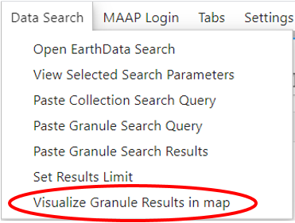

# README for Visualize Granule Results in CMC option for Data Search Tab

## Objective of the function
The objective of the function is to allow the user to easily visualize the results from their granule search from EarthData Search. Once the user runs a search in EarthData search and clicks on a granule, they can press the "Visualize Granule Results in CMC" button shown above in order to create a function call to `load_geotiffs` with the urls from their granule search results. The urls extracted abide by the user setting the results limit and they are filtered based on certain criteria

###  Criteria for filtering Granule Search Results
1. The url must begin with an s3 beginning (s3://- specified in`variables.json` in variable `required_starts`)
2. The url must end in a TIFF ending (.tif, .tiff- specified in `variables.json` in variable `required_ends`)
3. The url must not contain "orange-business" (specified in `variables.json` in variable `esa_data_location`). This is because there are permission issues when trying to access ESA data in NASA maap and orange business is where ESA hosts their data. 
4. The head request using boto3 has a status code of 200 when trying to access the data at the link 

### Additional functionality
If any urls are filtered out, an info message tells the user why the first 5 urls are filtered out. If there are no viable urls, then instead of a function call there is a comment in the Jupyter Notebook cell explaining what occurred. If there are urls, a function call is created that contains the default values that are passed to `load_geotiffs` if the user doesn't pass a value. The values are read from `variables.json`. 

This function searches the Notebook for the declaration of `ipycmc.MapCMC()`, if it is not found, then it is added to the Notebook in a different cell than the `load_geotiffs` function call. The Notebook specifically looks for `.MapCMC()` so if the user renames the ipycmc package the declaration can still be found. Even though `w` is the standard variable to assign to `ipycmc.MapCMC()`, the Notebook extracts the specific variable name that the user provides so that the call to `load_geotiffs` on that variable is accurate. 