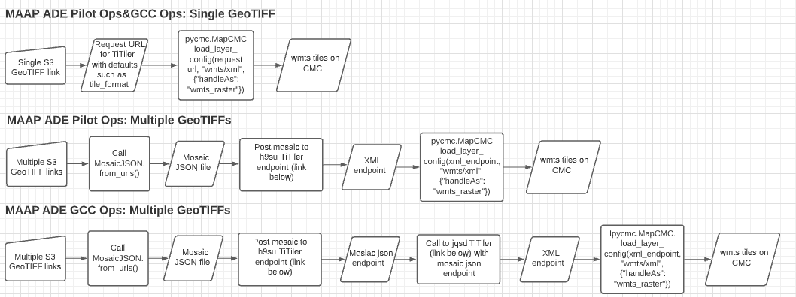

# README for load\_geotiff function
## Objective of this function
The goal of `load_geotiffs` is to take in the location of a geotiff in a MAAP ade s3 bucket and create a request url to a TiTiler endpoint (depending on MAAP environment). This request url points to an XML file that represents a WMTS capabilities file for the geotiff. This is passed to `load_layer_config`. A layer is loaded into CMC in a single seamless function call that can handle multiple geotiffs. In order for CMC to correctly display the tile request, certain default arguments need to be added onto this request url. In the case of a single geotiff, this is simple as the s3 link is added to the request url as an argument along with the default arguments. However, in the case of multiple geotiffs, a mosaic JSON must be created. The mosaic JSON is created through the `from_urls` or `from_features` methods in the `cogeo_mosaic` library created by Development seed. The mosaic JSON is then posted to a TiTiler endpoint where a WMTS capabilities link is returned. The default arguments are added to this WMTS capabilities link and then passed to `load_layer_config` as the request url. A user can always change the default arguments as described below. 

### Workflow diagram

* h9su TiTiler: [https://h9su0upami.execute-api.us-east-1.amazonaws.com](https://h9su0upami.execute-api.us-east-1.amazonaws.com)
* jqsd TiTiler: [https://jqsd6bqdsf.execute-api.us-west-2.amazonaws.com](https://jqsd6bqdsf.execute-api.us-west-2.amazonaws.com)

## Function definition: 
```
load_geotiffs(urls, default_tiler_ops = {}, handle_as = "", default_ops_load_layer = {}, debug_mode = True, time_analysis = False)
```
Function call must be on an IpyCMC.MapCMC object. For example, 
```
w = ipycmc.MapCMC()
w
w.load_geotiffs(urls="", default_tiler_ops={"colormap_name":"autumn", "pixel_selection":"mean"}, handle_as="wmts/xml", default_ops_load_layer={"handleAs": "wmts_raster"}, debug_mode = True, time_analysis = False)
```
### Arguments
* `urls`: where urls must be:
	*  a string consisting of a single link to a geotiff in an s3 bucket in the MAAP ade (private or bucket bucket will suffice). Currently, this string must start with "s3://" and end with ".tif" or ".tiff". However, this can be changed by modifying the `required_starts` and `required_ends` lists in variables.json. Even if these arguments are changed, if the beginning and ending types of the links do not comply with the TiTiler requirements, an error message will be returned and tiles cannot be generated.
    * a list consisting of links to geotiffs where each link follows all the guidelines listed above 
    * a string pointing to a folder in an s3 bucket. All files in this folder will be added to a list as long as they end in one of `required_ends`
* `default_tiler_ops`: Arguments to be passed to the request url to the TiTiler. This variable must be a dictionary where the key is one of the parameters below and the value is the argument to be passed for that parameter. Below are the descriptions provided by Development Seed.
   * `tile_format`: Output image type, `string`. Can only be certain value specified in `variables.json`
   * `tile_scale`: Tile size scale. 1=256x256, 2=512x512..., `integer`
   * `pixel_selection`: Pixel selection method, `string`. Can only be certain values specified in `variables.json`. Primarily used for mosaic json (i.e. multiple geotiffs at once)
   * `TileMatrixSetId`: TileMatrixSet Name (set values that represent a projection), `string`. Can only be certain value specified in `variables.json`
   * `resampling_method`: Resampling method, `string`. Can only be certain value specified in `variables.json`
   * `return_mask`: Add mask to the output data, `boolean`
   * `rescale`: comma (',') delimited Min,Max bounds, `string`
   
    #### Additional arguments you can add that are not typically added as defaults (Note: you can change the defaults by modifying `defaults_tiler` in variables.json:)
   * `minzoom`:  Overwrite default minzoom, `integer`
   * `maxzoom`: Overwrite default maxzoom, `integer`
   * `bidx`: comma (',') delimited band indexes, `string`
   * `expression`: rio-tiler's band math expression (e.g B1/B2), `string`
   * `nodata`: 	Overwrite internal Nodata value
   * `unscale`: Apply internal Scale/Offset, `boolean`
   * `color_formula`: rio-color formula (info: [https://github.com/mapbox/rio-color](https://github.com/mapbox/rio-color)), `string`
   * `colormap_name`: Colormap name affecting the colors of the tiles mapped, `string`. Can only be certain value specified in `variables.json`
   * `colormap`: JSON encoded custom Colormap, `string`
   
   __For more documentation about these arguments, please visit: [https://h9su0upami.execute-api.us-east-1.amazonaws.com/docs#](https://h9su0upami.execute-api.us-east-1.amazonaws.com/docs#)__
   
 * `handle_as`: Default is "wmts/xml", but this can be changed by modifying `default_handle_as` in variables.json 
  * `default_ops_load_layer`: Default is `{"handleAs": "wmts_raster"}`, but this can be changed by modifying `default_ops_load_layer` in variables.json
  * `debug_mode`: Default is `True`. This provides checks and detailed descriptions of the error that occurred as well as potential fixes. If you receive an unknown error please run in debug mode. The default value of `debug_mode` can be changed by modifying `variables.json`.
  * `time_analysis`: Default is `False`. The intent of this parameter is to show the speed of the function when running the function in debug mode or not. This only shows the time to complete `load_geotiffs` and not a call to `load_layer_config`. The function call to `load_geotiffs` that is mapped on CMC is the one with the given `debug_mode` or `True` if not provided. The default value of `time_analysis` can be changed by modifying `variables.json`.


### Creating s3 link to pass to `load_geotiffs` from your s3 bucket
The s3 link(s) passed to `load_geotiffs` should be in the form of `s3://bucket-name/key-name`. The bucket name and key name can be found by:
1. Right clicking on a file in your s3 bucket
2. Clicking "Get Presigned s3 Url"
3. Look between "https://" and "s3.*Region*.amazonaws.com" to find the bucket name. For more details visit [https://docs.aws.amazon.com/AmazonS3/latest/userguide/access-bucket-intro.html](https://docs.aws.amazon.com/AmazonS3/latest/userguide/access-bucket-intro.html). For example, in the presigned url `https://maap-ops-workspace.s3.amazonaws.com`, `maap-ops-workspace` is the bucket name.
4. After finding the bucket name, find the key name by looking after "s3.*Region*.amazonaws.com" and before the "?" in the presigned s3 url. The key name should include your maap username as well as the file path to your file (including your file name and ending type). 

Put the bucket name and key name together in the form of `s3://bucket-name/key-name`. An example of this would be `s3://maap-ops-workspace/graceal/geoTiffs/N46W102.SRTMGL1.tif`

## Error checking performed by `load_geotiffs`
##### Variables.json
* All required keys are present in variables.json. Required keys can be found in the file `loadGeotiffs/requiredInfoClass.py`.
* All of the required keys are non-empty.
* All TiTiler endpoints (`posting_tiler_endpoint`, `endpoint_published_data`, `endpoints_tiler.values()`) begin with one of `web_starts` (i.e. https:// or http://)
##### General argument checking
* Urls is either string or list
* Urls is non-empty
* Urls (and every element if list) begins with one of `required_starts`
* If list of urls, each element has the same s3 bucket name or the data is published
* One of the keys passed for `default_tiler_ops` is not found as a valid key in `defaults_tiler` or `accepted_arguments_tiler`
* One of the parameters passed for `default_tiler_ops` is not the correct class type 
* One of the parameters passed for `default_tiler_ops` is not one of the values accepted for the finite list of accepted arguments (i.e. for the parameters. This can be specified in `variables.json`
*  `TileMatrixSetId`, `resampling_method`, `colormap_name`, `tile_format`, and `pixel_selection`). This can be specified in `variables.json`
* s3 bucket name of s3 link is not one of `endpoints_tiler.keys()`
* The bucket name cannot be found in the s3 link because of incorrect amount of "/"s

##### Errors with request url
* If the information at request url does not begin with an xml beginning then the json formatted error message for the TiTiler is printed. This json formatted error message might be one of the known TiTiler errors and have a translated response with explanation, or it may just be the exact TiTiler error. 

##### Errors with s3 bucket folder as urls
* Access denied when trying to read through buckets of given s3 bucket environment
* No geotiffs in given folder (i.e. no files have any of `required_ends`)

##### Errors with multiple s3 links
* Any one of the individual s3 links cannot be correctly completed in a single geotiff TiTiler request (this is likely an access denied error, but the exact TiTiler error message will be printed)

## Documentation for variables.json 
Variables.json is located at `maap-jupyter-ide/ipycmc/ipycmc/loadGeotiffs`

#### Explanation of values
* `required_starts`: How the urls must begin in order for function to complete successfully
* `required_ends`: How the urls must end in order for function to complete successfully. Note that in the case of a folder for urls, the folder should not end in one of `required_ends`, but the contents of the folder should end in one of `required_ends`
 * `defaults_tiler`: The default values to pass in the request url to the TiTiler represented as a dictionary where the key is the name of a variable that the TiTiler accepts and the value is the value of that variable. Note that these values can be provided by the user. If these values are not provided by the user, they will be passed into the request url as is from this variable. This is because the tiles may not display without these defaults, especially the `rescale` option.
 * `accepted_parameters_tiler`: Similar to `defaults_tiler`, this variable represents parameters that can be passed to request url to TiTiler. These parameters don't need to be specified, but can be if the user wishes. More detail about these parameters can be found above.
 * `endpoints_tiler`: Dictionary where the key representing the workspace bucket name of MAAP ade environments supported by this function and the values represent the TiTiler endpoint that these environments are compatible with. Note that currently only gcc ops and Pilot ops are supposed by this function (maap-ops-workspace found at [https://ade.ops.maap-project.org/](https://ade.ops.maap-project.org/) and maap-ops-dataset found at [https://ade.maap-project.org/](https://ade.maap-project.org/))
 * `tiler_extensions`: Since a user can either pass a single geotiff or multiple geotiffs, this variable indicates the extension to the request url to the TiTiler for either a single geotiff or multiple geotiffs. These represent supported extensions to TiTiler endpoints.
 * `endpoint_published_data`: This represents the TiTiler endpoint to be used for published data. Unlike `endpoints_tiler` published data doesn't need to use a certain TiTiler endpoint. By default, it uses the Tiler ops endpoint, but that can be changed at any time by modifying this variable.
 * `posting_tiler_endpoint`: This represents the TiTiler endpoint that has the capability of posting a mosaic json so that link can later be fetched to create the request url to be passed to `load_layer_config`.
  * `errors_tiler`: This is a dictionary where the keys are known TiTiler error messages that appear as the detail value in a TiTiler error message. The values are the appropriate response if one of these error messages is contained in the request url to pass to `load_layer_config`. If one of these errors is found, then the request url is not passed to `load_layer_config` and the function ends. The goal of this variable is to help decode the TiTiler error message for the likely MAAP ADE situation because they can be difficult to understand.
 * `correct_wmts_beginning`: Typically, the TiTiler returns correctly formatted wmts tiles as an xml object and returns an error message in JSON format. If that were to change, then this variable can be modified. If the content of the request url begins with `correct_wmts_beginning`, then the wmts request is considered correct. Otherwise, the correct error message is printed if it is contained in `errors_tiler` or the `general_error_warning_tiler` is printed.
 * `general_error_warning_tiler`: If the contents of the request url does not begin with `correct_wmts_beginning` and none of the keys of `errors_tiler` are present in the error message, then this general error warning is printed along with the contents of the request url.
 * `required_class_types_args_tiler`: For all parameters that the TiTiler endpoint accepts, this variable checks to make sure that the argument that the user passes is the correct class type that complies with what the TiTiler is expecting.
 * `tile_format_args`: This list represents the accepted arguments for the `tile_format` variable. If TiTiler changes then this variable might need to change as well. 
 * `pixel_selection_args`: This list represents the accepted arguments for the `pixel_selection` variable. If TiTiler changes then this variable might need to change as well. 
  * `getting_xml_endpoint`: This is the code that executes to extract the wmts endpoint from the mosaic json request post. For this code to execute correctly, the request variable needs to be named r. If the formatting of TiTiler endpoint request post changes, then this variable may need to change as well. 
  * `web_starts`: All TiTiler endpoints (`posting_tiler_endpoint`, `endpoint_published_data`, `endpoints_tiler.values()`) are required to start with one of these `web_starts`. This variable may be changed if you only want secure endpoints, i.e. change this to just a list of https://. Links starting with s3:// fall into a separate category than the TiTiler endpoints
 * `default_handle_as`: Default `handle_as` argument for `load_layer_config`. For more on documentation see [https://github.com/MAAP-Project/maap-jupyter-ide/blob/develop/user\_guides/ipycmc.md#class-mapcmc](https://github.com/MAAP-Project/maap-jupyter-ide/blob/develop/user_guides/ipycmc.md#class-mapcmc)
 * `default_ops_load_layer_config`: Default `default_ops` argument for `load_layer_config`. For more on documentation see [https://github.com/MAAP-Project/maap-jupyter-ide/blob/develop/user\_guides/ipycmc.md#class-mapcmc](https://github.com/MAAP-Project/maap-jupyter-ide/blob/develop/user_guides/ipycmc.md#class-mapcmc)
 * `default_debug_mode`: Dictates if `load_geotiffs` will run in debug mode or not if the user doesn't specify `debug_mode`. `True` currently (recommended setting)
 * `default_time_analysis`: Dictates if `load_geotiffs` will run with time analysis or not if the user doesn't specify `time_analysis`. `False` currently (recommended setting)
 * `esa_data_location`: Indicates where ESA keeps their data because there will likely be permission errors for TiTiler or `load_layer_config`. Currently ESA hosts their data at `orange-business`.
 * `s3_beginning`: How the NASA data is stored in s3 buckets. This variable is currently `s3://`, but note that if the location of NASA's data changes needs to change, changing this variable might not be enough

#### Changing content of variables.json
Note that only technical users should change the content of variables.json because the code must be redeployed in order for the changes to take effect. 
   
### Debug mode
Running not in debug mode is a risk if you do not understand how the function works since there is minimal error checking and you are not provided with detailed responses. If you receive an error message you do not understand, run the problem in debug mode. Debug mode is enabled by default, but this can be changed in `variables.json`.

### Time analysis
The only difference in setting this parameter to True is that the function call is done twice (once with debug mode and once without) and the results are printed. The request url generated for the given parameters including the given `debug_mode` are sent to `load_layer_config` as the function normally does. This function takes longer to run and the only purpose of it is to show the effects of `debug_mode` so that users can decide if they would like to run in that mode. Note that `time_analysis` is False by default, but this can be changed in `variables.json`.

### Troubleshooting
* Rerun the `load_geotiffs` function if the map layer does not show up the first time.
* If a layer loads, but you cannot see any tiles, this is likely a CORS policy error and you do not have permission to the data
* If the tile shows up and is all white with no details, then that is an error with the rescale value passed to the TiTiler