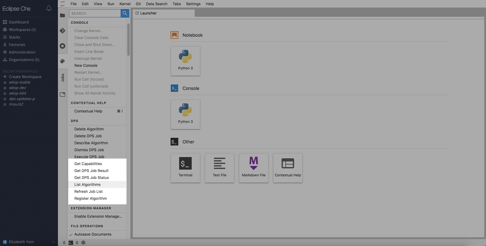

# Algorithm Registration

## List Algorithms

A user can execute a job with any algorithm that has been published to the MAAP Algorithm Store (MAS).  To view what algorithms are available, click on `Command Palette` -> `DPS` -> `List Algorithms`.  Algorithms are listed in the format `<algorithm-name>:<version>`.

Users will be shown the same list in a dropdown menu when trying to execute a job.

## Describe an Algorithm

A user can request more information about available algorithms.  Click on `Command Palette` -> `DPS` -> `Describe Algorithm`.

A popup window will appear, asking the user to select an available algorithm.  
A second popup window will follow, listing the algorithm's registered name, version, identifier, any required inputs, and expected outputs.

## Register an Algorithm

Go to `Command Palette` -> `DPS` -> `Register Algorithm`. The user is be shown a dropdown menu with available Python source files or Python notebook files.

After selecting the desired script, the user is prompted with a new dialog box to populate required information for registering the script as an algorithm.  The name is pre-populated from the filename, and environment is set to `ubuntu`, which most ADEs are running on.

Enter the command to run the script in `run_cmd` (e.g. `python3 plot.py`) and required parameters for the algorithm in `inputs` (e.g. `pass_number`), each on its own line.  The algorithm name and description can be changed if desired.  Click `OK` to finish registering.  The user is then given a response if the request for registration was successful, or if some error occurred.

NOTE: After registering a new algorithm, a corresponding docker image must build successfully in GitLab before the algorithm is available for job submission.

## Delete an Algorithm

Go to `Command Palette` -> `DPS` -> `Delete Algorithm`.  The user is show a dropdown menu with available containerized algorithms to remove.

---
If at any point the user does not get the expected output or behavior, it is possible that user's session cookie has expired and will need to refresh the page.