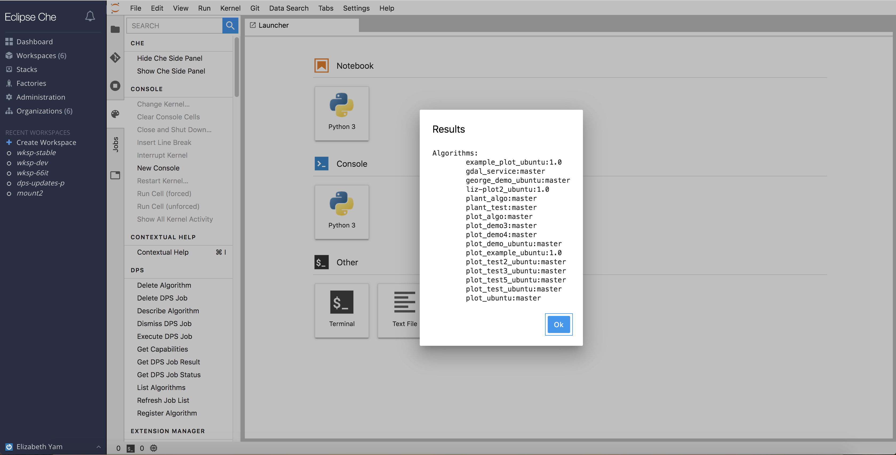

## List Algorithms

A user can execute a job with any algorithm that has been published to the MAAP Algorithm Store (MAS).  To view what algorithms are available, click on `Command Palette` -> `DPS` -> `List Algorithms`.  Algorithms are listed in the format `<algorithm-name>:<version>`.

Users will be shown the same list in a dropdown menu when trying to execute a job.

