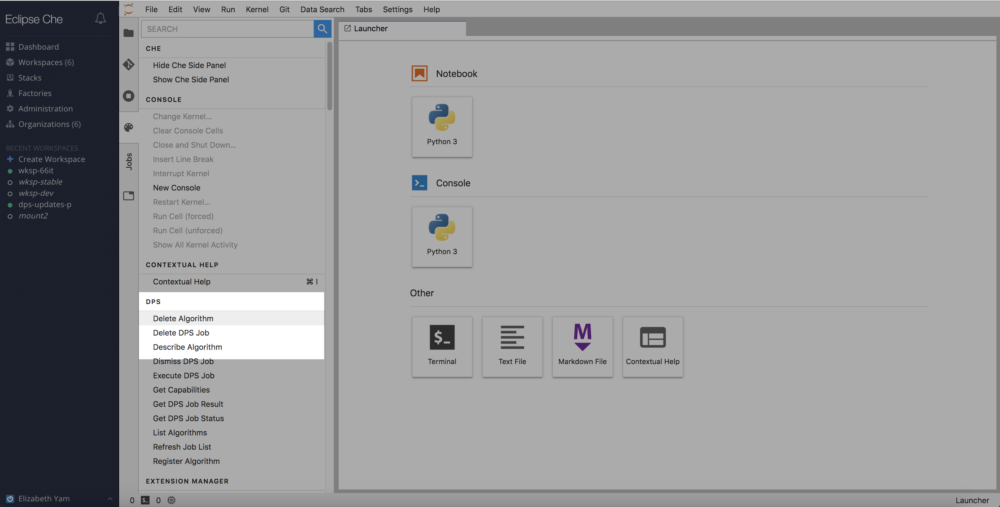
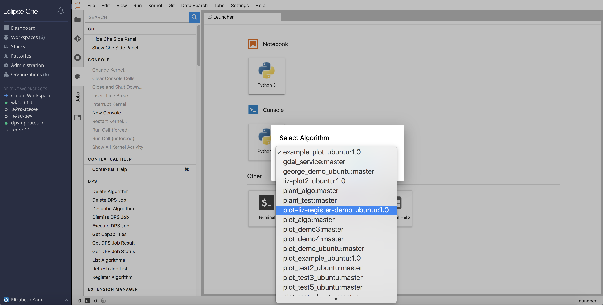
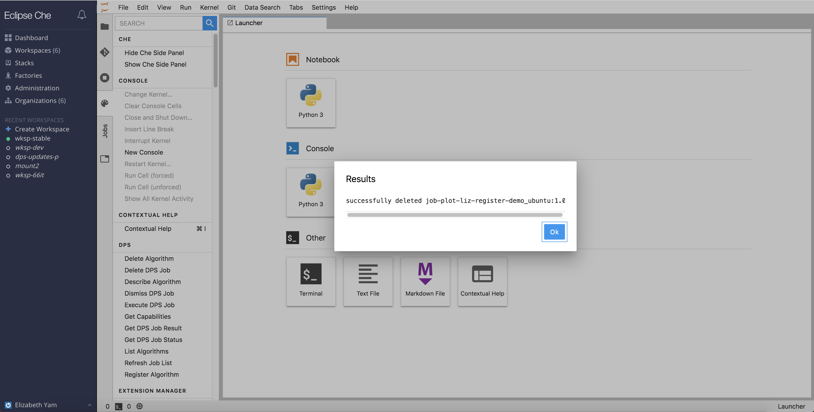

## Delete an Algorithm

Go to `Command Palette` -> `DPS` -> `Delete Algorithm`.  The user is show a dropdown menu with available containerized algorithms to remove.

---
If at any point the user does not get the expected output or behavior, it is possible that user's session cookie has expired and will need to refresh the page.