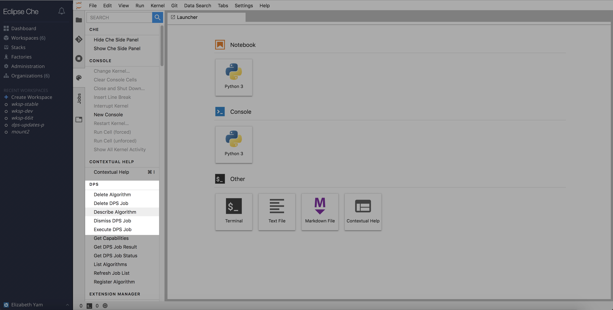
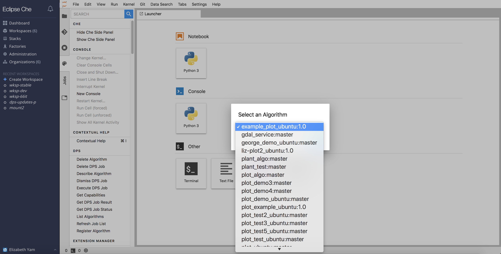
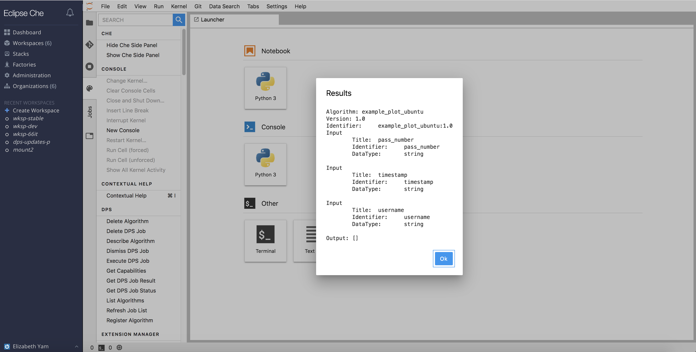

## Describe an Algorithm

A user can request more information about available algorithms.  Click on `Command Palette` -> `DPS` -> `Describe Algorithm`.

A popup window will appear, asking the user to select an available algorithm.  
A second popup window will follow, listing the algorithm's registered name, version, identifier, any required inputs, and expected outputs.

