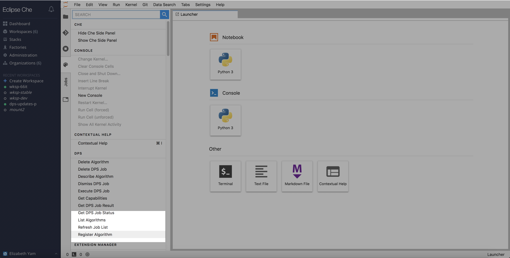
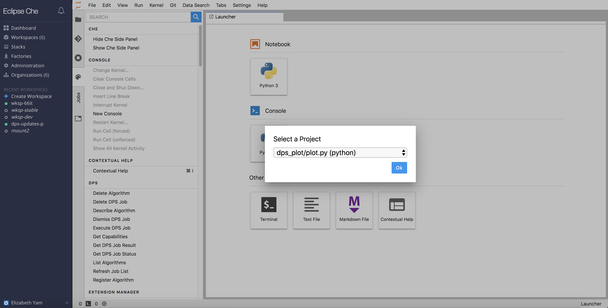
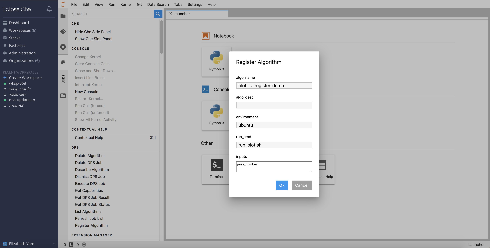
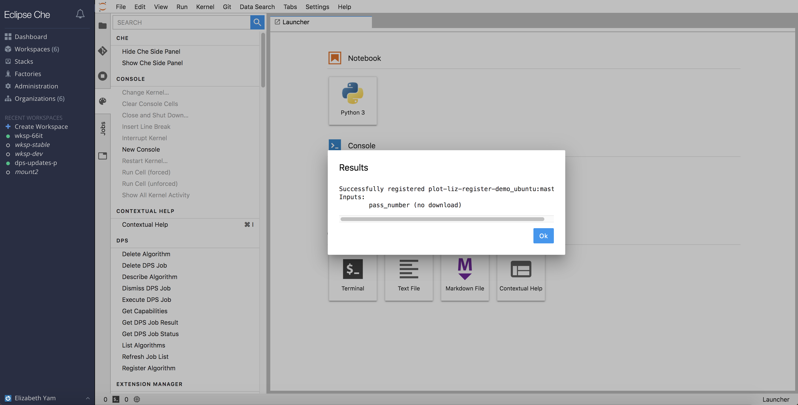

## Register an Algorithm

Go to `Command Palette` -> `DPS` -> `Register Algorithm`. The user is be shown a dropdown menu with available Python source files or Python notebook files.

After selecting the desired script, the user is prompted with a new dialog box to populate required information for registering the script as an algorithm.  The name is pre-populated from the filename, and environment is set to `ubuntu`, which most ADEs are running on.

Enter the command to run the script in `run_cmd` (e.g. `python3 plot.py`) and required parameters for the algorithm in `inputs` (e.g. `pass_number`), each on its own line.  The algorithm name and description can be changed if desired.  Click `OK` to finish registering.  The user is then given a response if the request for registration was successful, or if some error occurred.

NOTE: After registering a new algorithm, a corresponding docker image must build successfully in GitLab before the algorithm is available for job submission.