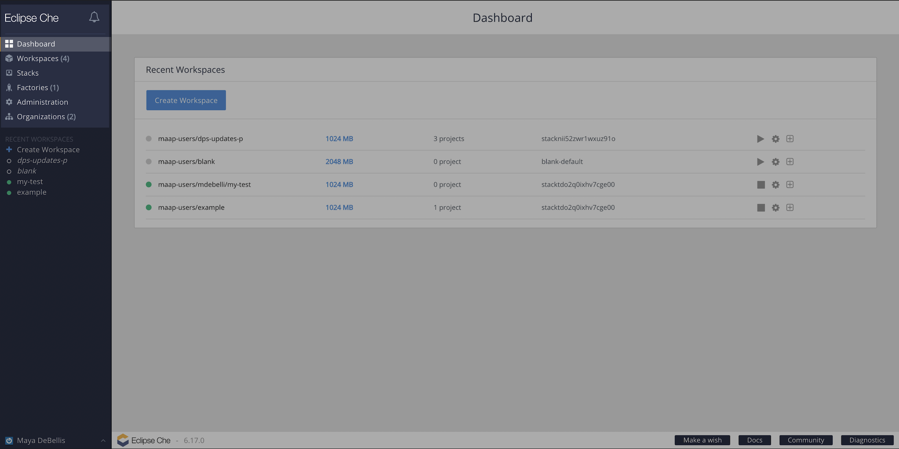
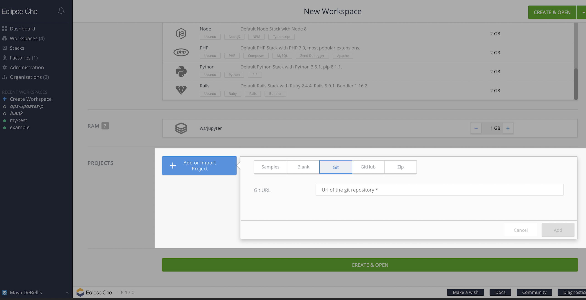
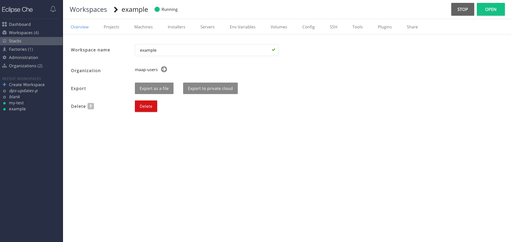

# What Not to Do!

We tried to use as many out of the box technologies as possible in this project to get as many features
available as possible. But with that comes a lot of features that are not relevant to our platform or 
have not been implemented on our side yet. As we continue to build MAAP this list should become shorter
and shorter, but for now here are the things that you should not mess with. 

If you happen to mess with one of these things, you'll probably be fine - you'll just end up with a bunch
of errors you don't understand or just nothing happening when you click a button.

## Side Panel

What's relevant: Workspaces, Organizations.

What's not: Stacks, Factories, Administration.

---
### Workspace Administration

#### Adding a workspace
##### What to do
Configure the name, organization, RAM, and projects.

##### What NOT to do
Use the wrong stack. For now, only run the stack ` maap-jupyter-ide stable build`

When adding projects, only add projects with the `Git` tab. Do not use any of the other project tabs.

#### Managing a workspace

Here are the features allowed/not allowed on all of the workspace administration tabs.

| Tab           | Features |
| -----------   | ----------- |
| Overview      | Do not bother with the `Export` buttons - these are not relevant.|
| Projects      | When adding projects, only add projects with the `Git` tab. Do not use any of the other project tabs.|
| Machines      | Do not add a machine! Do not play with any of the actions! The only thing you can do here is change
                  the RAM. |
| Installers    | The `Exec` and `SSH` installers must be turned on here in order to get SSH access to your machine. 
                  All other installers are not relevant and should not be turned on. |
| Servers       | Do not touch! |
| Env Variables | This is allowed! |
| Volumes       | Do not touch! |
| Config        | Do not touch! |
| SSH           | Do not touch! SSH has been handled for you and adding a key here will not work. |
| Tools         | Do not touch! |
| Plugins       | Do not touch! |
| Share         | Do this! All of the features should be implemented here. |

---
### Organizations
#### What to do

#### What NOT to do