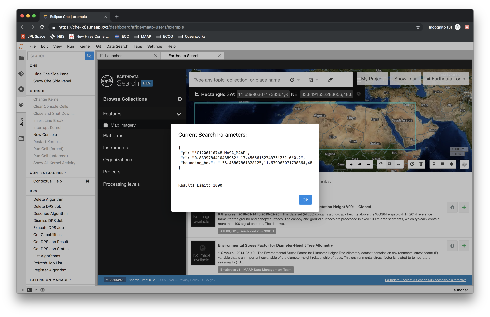

# Earthdata Search

## Finding data

To find data, open the Earthdata Search client using the `Data Search` tab on the toolbar.
Instructions for using the Earthdata Search client can be found [here]().

To see what search parameters you have selected in your EDSC session, select
`View Selected Search Parameters` on the dropdown menu.

## Adding data to a notebook

Once you have selected the data that you want to work with, it's time to transfer that
information to a notebook. There are 2 options for this - you can either insert a search
query, or the results of that query (a list of links to the data).

To choose and insert, select an option in the dropdown menu:

In order to run the search command, and make other helpful calls for interacting
with the data, you need to have the MAAP library imported into your notebook. On
the notebook toolbar there is a helpful button that will insert all the MAAP
defaults.

## Visualizing data in a notebook