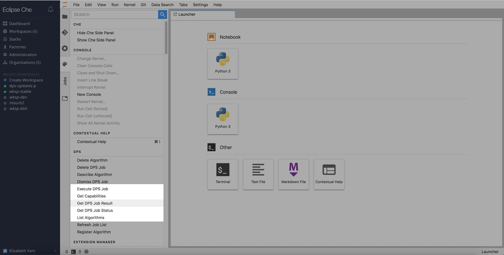
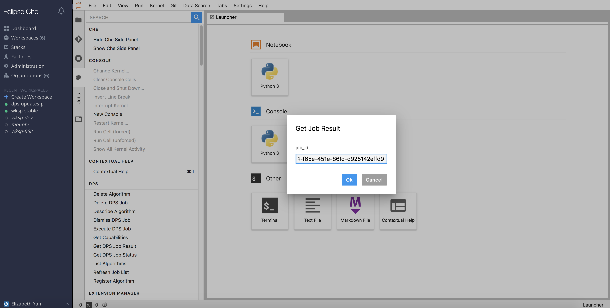
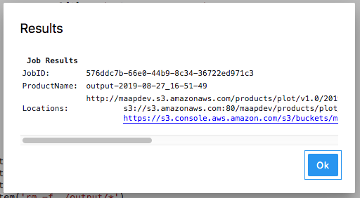

## Check Job Results

The easiest way to check a job's status is to find and click on it on the `Jobs` pane.  

Alternatively, if the job was submitted under a different user, and the Job ID is known, the user can check the job status by going to `Command Palette` -> `DPS` -> `Get DPS Job Result`.  A series of dialogs similar to `Get Status` will popup.

