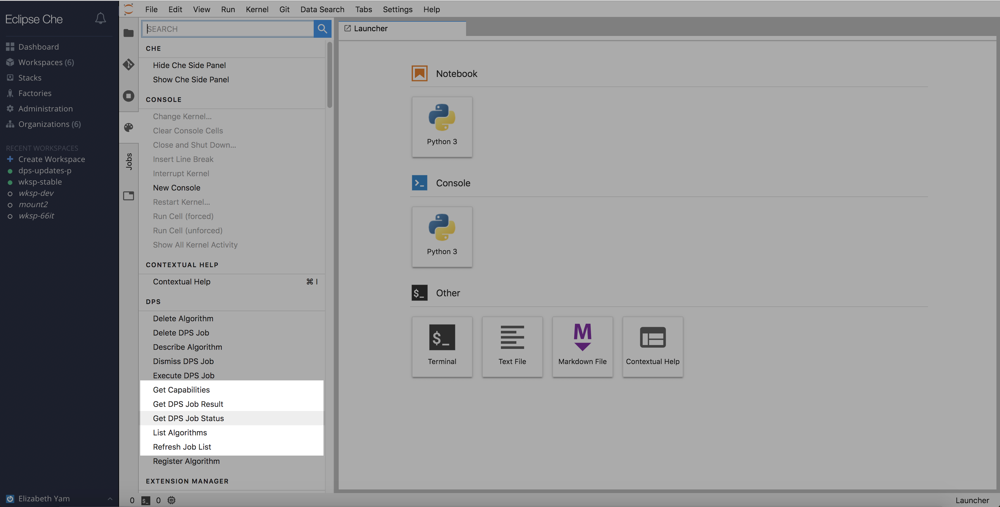

## Check Job Status

The easiest way to check a job's status is to find it on the `Jobs` pane.  (see `List Previous Jobs` above)

Alternatively, if the job was submitted under a different user, and the Job ID is known, the user can check the job status by going to `Command Palette` -> `DPS` -> `Get DPS Job Status`.

