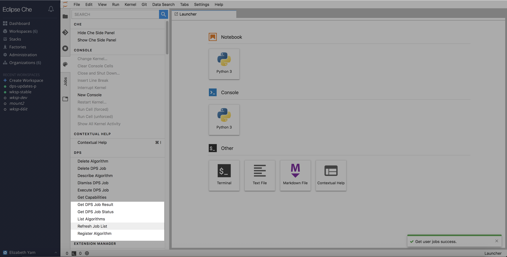
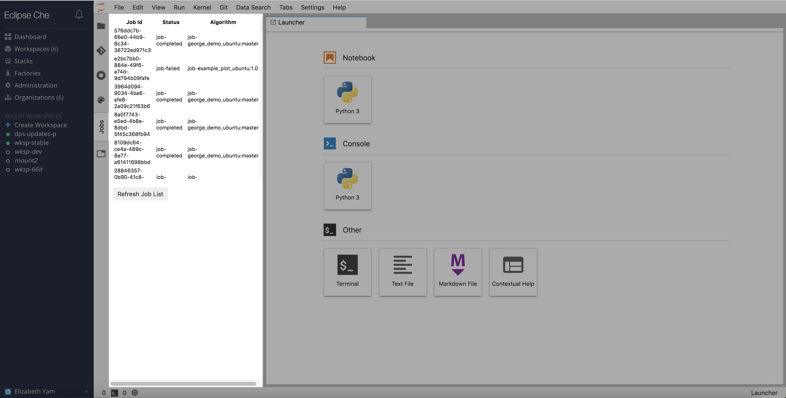
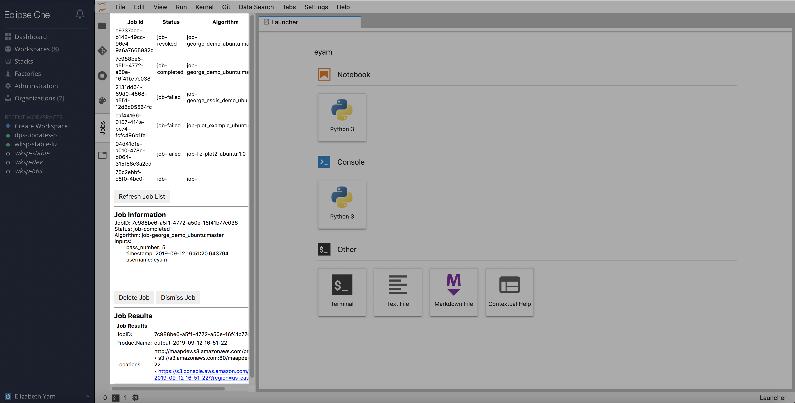
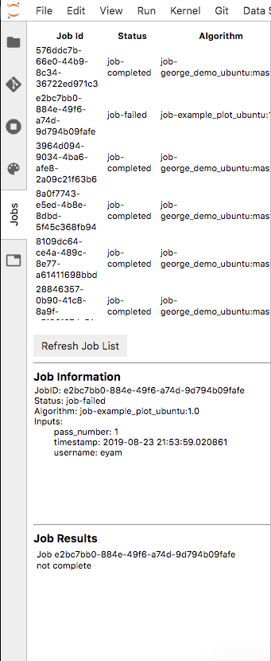

## List Previous Jobs

The `Jobs` pane will need to be manually (re)loaded.  This can be done by going to the `Command Palette` -> `DPS` -> `Refresh Job List`.  Once this happens, the `Jobs` pane will display a scrollable, up-to-date table of the user's job history with Job Id, Job Status, and Algorithm, sorted by the most recently submitted job.  From here, users can go directly to the s3-hosted results of a completed job or delete the currently viewed job.

Click on the row containing the job of interest for more information about inputs and results.

 
