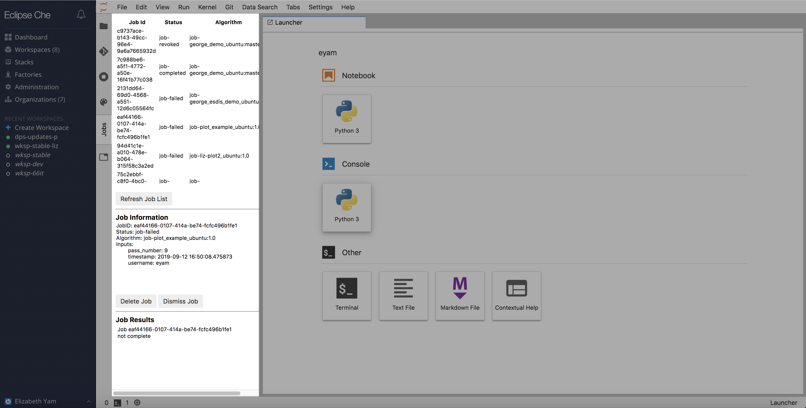
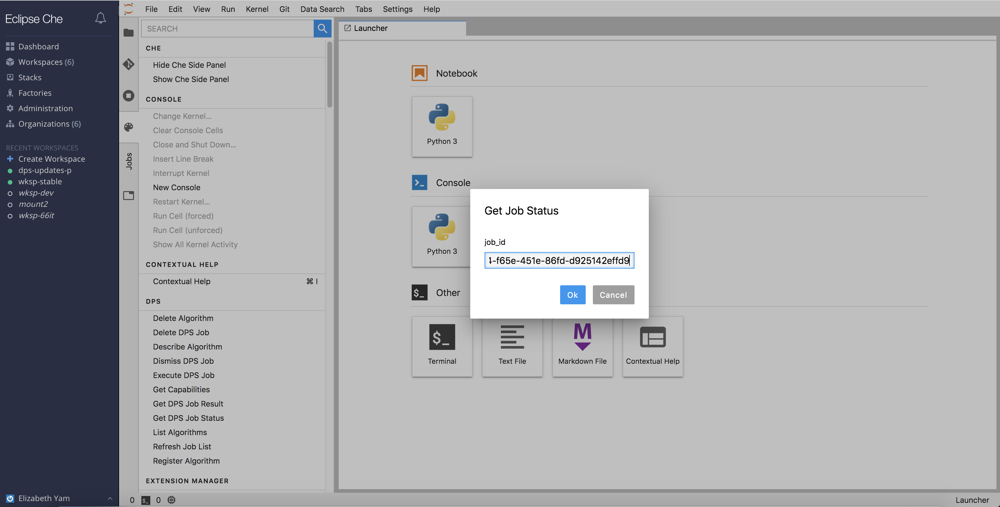
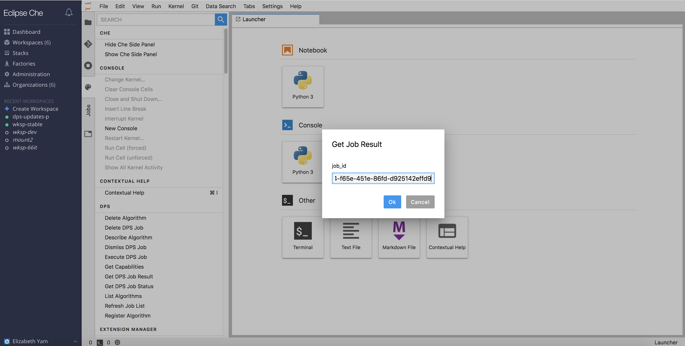
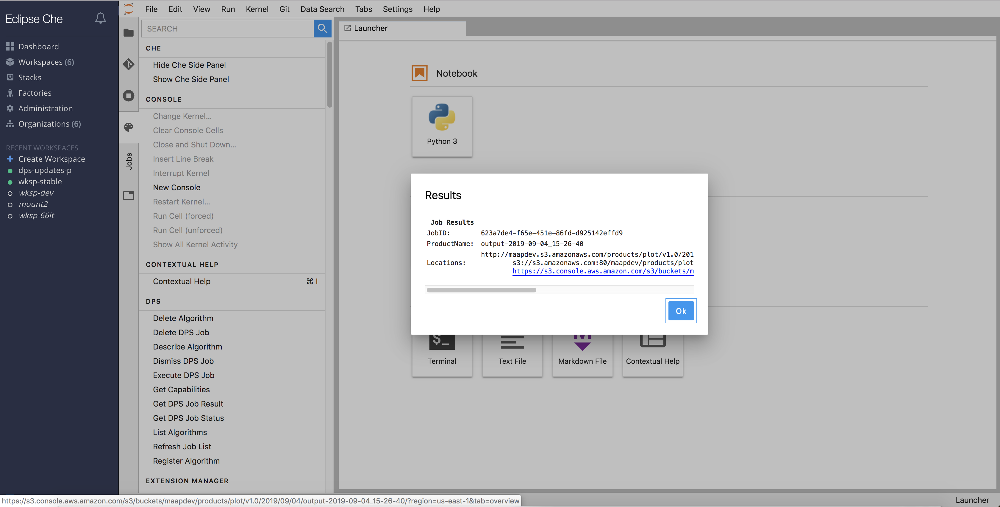

# Job Submission

## List Previous Jobs

The `Jobs` pane will need to be manually (re)loaded.  This can be done by going to the `Command Palette` -> `DPS` -> `Refresh Job List`.  Once this happens, the `Submitted Jobs` pane will display a scrollable, up-to-date table of the user's job history with Job Id, Job Status, and Algorithm, sorted by the most recently submitted job.  

Click on the row containing the job of interest for more information about inputs and results.

 

## Execute a Job

To execute a job, click on `Command Palette` -> `DPS` -> `Execute DPS Job`.

A popup window will appear, asking the user to select an available algorithm.
Next, the user will be prompted to enter the required inputs for the selected algorithm.  Upon submission, a Job ID will be returned.

Note: The `Job Submissions` must be manually reloaded to show the newly submitted job.

## Check Job Status

The easiest way to check a job's status is to find it on the `Jobs` pane.  (see `List Previous Jobs` above)

Alternatively, if the job was submitted under a different user, and the Job ID is known, the user can check the job status by going to `Command Palette` -> `DPS` -> `Get DPS Job Status`.

## Check Job Results

The easiest way to check a job's status is to find and click on it on the `Submitted Jobs` pane.  

Alternatively, if the job was submitted under a different user, and the Job ID is known, the user can check the job status by going to `Command Palette` -> `DPS` -> `Get DPS Job Result`.

## Delete Job

Deleting a job means removing any record of a job that has already been attempted and failed or completed.  To delete a job, go to `Command Palette` -> `DPS` -> `Delete DPS Job`.  A popup will appear, prompting the user to enter the job id.

## Dismiss Job

Dismissing a job is to stop a job that is currently running already.  To dismiss a job, go to `Command Palette` -> `DPS` -> `Dismiss DPS Job`.  A popup will appear, prompting the user to enter the job id.

---
If at any point the user does not get the expected output or behavior, it is possible that user's session cookie has expired and will need to refresh the page.