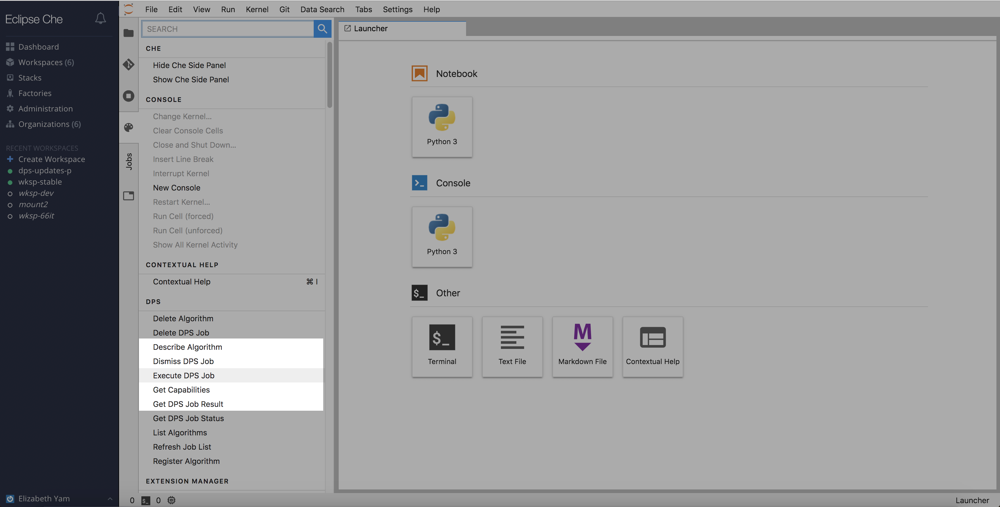
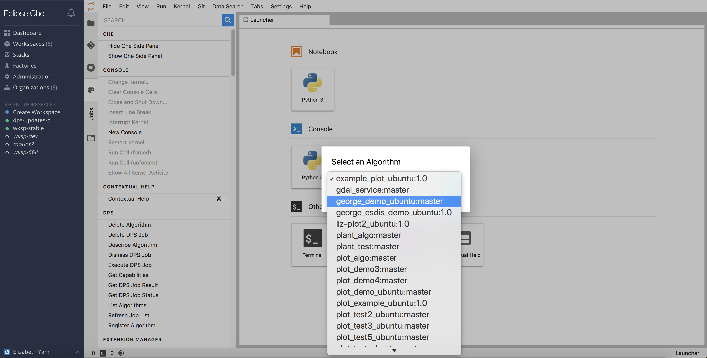

## Execute a Job

To execute a job, click on `Command Palette` -> `DPS` -> `Execute DPS Job`.

A popup window will appear, asking the user to select an available algorithm.
Next, the user will be prompted to enter the required inputs for the selected algorithm.  Upon submission, a Job ID will be returned.

Note: The `Job Submissions` must be manually reloaded to show the newly submitted job.

