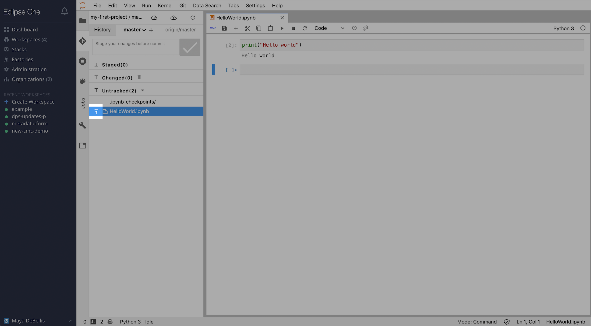
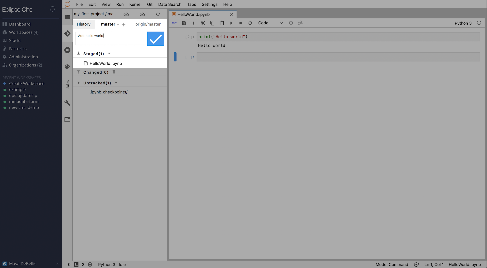
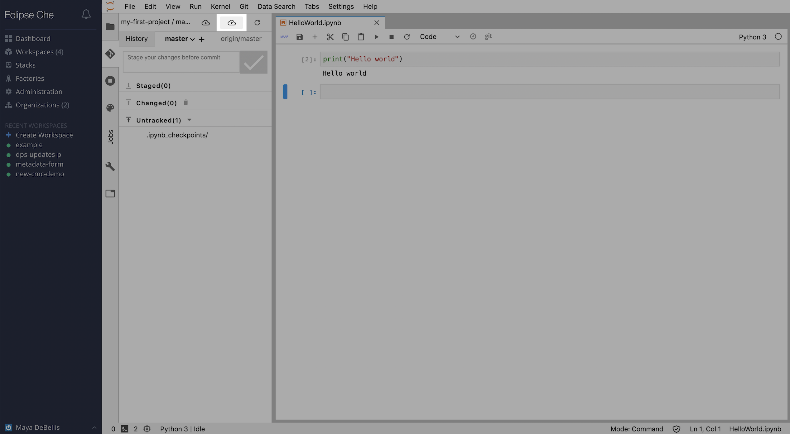
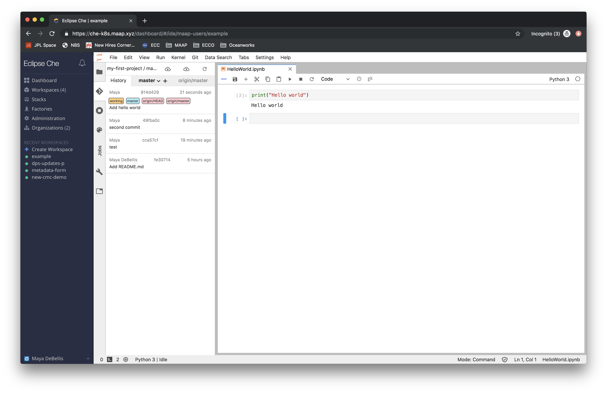

## Creating a project

The first step in getting started with projects in MAAP is going to MAAP's
GitLab and creating a new project. When you create a MAAP account, an account is
automatically configured for you on MAAP's (GitLab instance)[https://repo.maap-project.org/].

To sign in, click on `Sign in with CAS`, then use your URS or ESA login. This will direct
you to your projects.

Click on `Create a project`. Name your project and select it's visibility level:
- Projects will default to `private`, meaning only you can see it, and if you want to allow another
user to contribute, you will have to explicitly add them in the gitlab interface. **NOTE:
Adding a user to a workspace that has a project in it does not automatically give them access
to your gitlab project, you must also add them to the private project if you want to
allow them to make changes.**
- Projects set to `internal` can be seen by any authenticated MAAP user.
- Projects set to `public` can be seen by anyone, regardless of whether they are a MAAP
user or not.

Once you have created a project, copy the https url for the project the can be found under 
the clone button's dropdown. You will use this to add your project to you Che workspace.

## Adding a project to your workspace

Projects can be added to a workspace during or after workspace creation. If a project is
added after a workspace exists, the workspace must be restarted when the projects are added.
After restart, your projects will automatically appear in your workspace.

 

## Updating your project from inside your workspace

All projects imported from GitLab can be found in `/projects`.

Using the left side panel in the jupyter interface, you can push changes to your gitlab project.

If you are more comfortable using the command line to interact with git, you do not need to use
the side panel. It will work the same way in the terminal, once you navigate to the project's filepath.

When you are ready to update your project with your changes, navigate to the git panel.
Add the files you want to change to the list of list of staged changes. Then write a 
commit message, and click the check. Now you need to push your changes by selecting the
push changes button on the toolbar.

If you want to check your commit history, look at branches, and confirm your
updates have been pushed, you can see this on the history tab.

