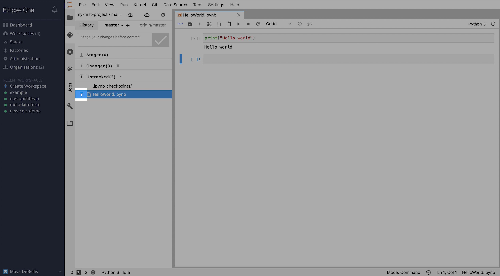
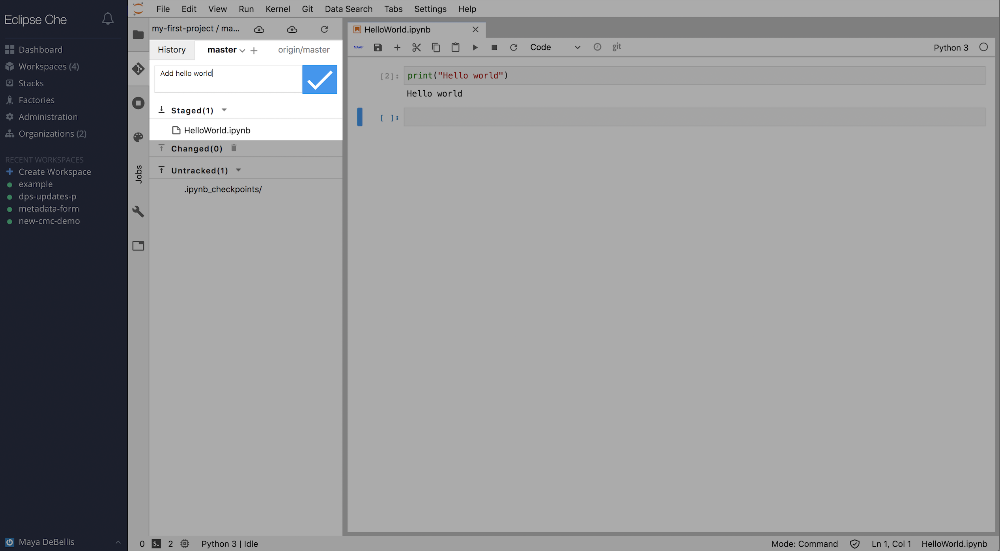
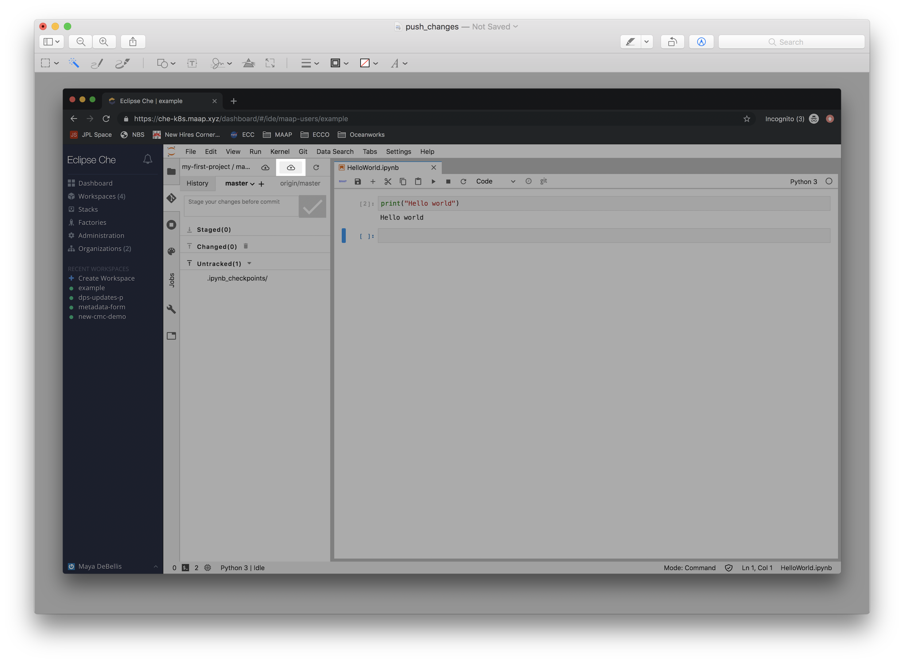
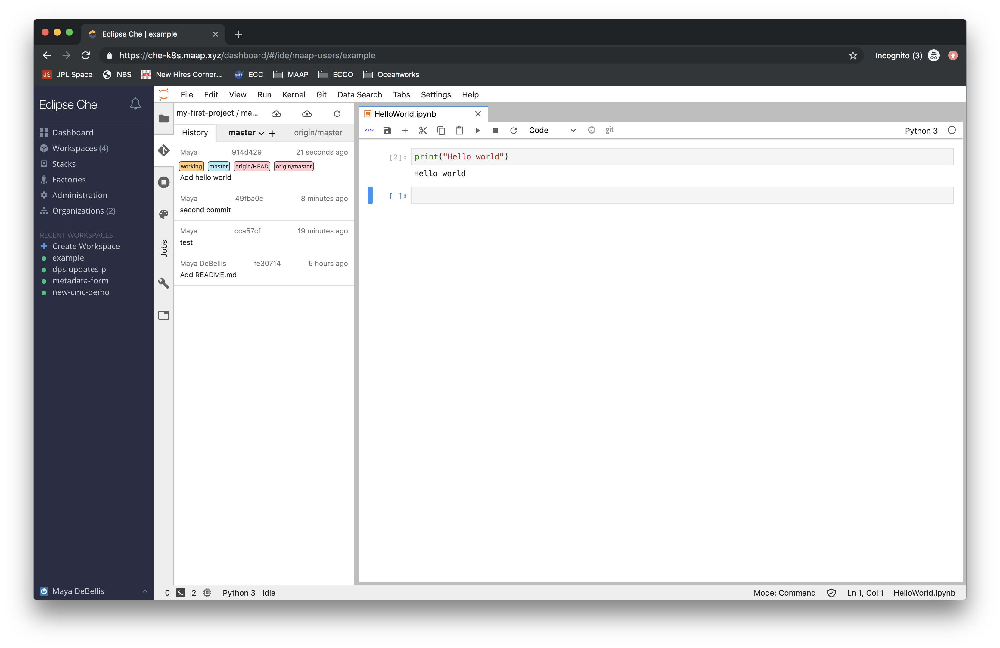

## Updating your project from inside your workspace

All projects imported from GitLab can be found in `/projects`.

Using the left side panel in the jupyter interface, you can push changes to your gitlab project.

If you are more comfortable using the command line to interact with git, you do not need to use
the side panel. It will work the same way in the terminal, once you navigate to the project's filepath.

When you are ready to update your project with your changes, navigate to the git panel.
Add the files you want to change to the list of list of staged changes. Then write a 
commit message, and click the check. Now you need to push your changes by selecting the
push changes button on the toolbar.

If you want to check your commit history, look at branches, and confirm your
updates have been pushed, you can see this on the history tab.

