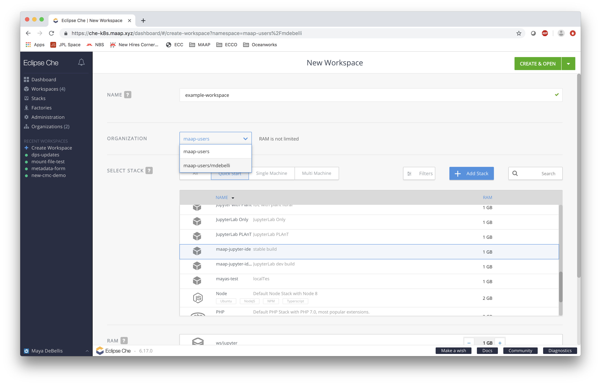

# Sharing

## Organizations

We are utilizing Eclipse Che’s Organizations feature to allow users to share workspaces 
with other MAAP users. If a workspace is created in an organization, a user can easily
share that workspace with other members of the organization. 

#### All users are in one shared org

Users can be in multiple organizations. There is one organization, called `maap-users` that
all users are in. This allows for users to be able to see all the possible MAAP users to
share with.

#### All users have their own personal org they can customize

Users all also have their own personal organization. Each user is the admin of their
own organization so they can easily curate groups and individuals that they share their
work with often. 

To add a user to your personal organization, add them as a member.

To create a group of users you want to share with, create a SubOrganization in your
personal organization.

#### Creating workspaces in an organization's namespace

All workspaces are created under the namespace of an organization.
**NOTE:** Once a workspace is created under an organization it cannot be moved to a 
different organization.

To specify which organization you want a workspace to be a part of, specify using the
dropdown on workspace creation.

Once a workspace is created, it is not inherent that all memebers of that organization
are able to see it. You must share with them after it is created. This can be found in
workspace's `Share` tab.

