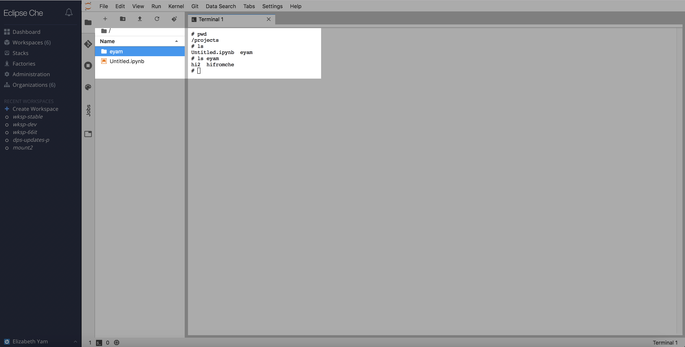

## Sharing Data

Users who have access to a workspace have access to all the files contained in that workspace.

#### All users have their own personal s3-bucket folder mounted in the FileBrowser home

In `/projects`, each user has a personal s3-hosted folder with the same name as their CAS username.  Files in this 
folder are automatically uploaded to s3 and will accessible from any workspace a user signs into.

The intention of this mounted folder is that you can use this to share data with others, and also store files you
want to access across different workspaces. It is not intended that you do all of your work in this directory. Because
this directory is mounted to s3, you will notice that processes are slower when working in this directory.

### Generating a shareable link to s3-hosted files

Users can create a shareable link for any files in their folder that is hosted on s3. To do this, go to 
`Command Palette` -> `User` -> `Get Presigned S3 URL` and enter the relative path to the file you want to share.  
The link will expire after 12 hours.

See [Notebook Magics](./notebook_magics.md) for how to get the presigned s3 url from an inline notebook command.