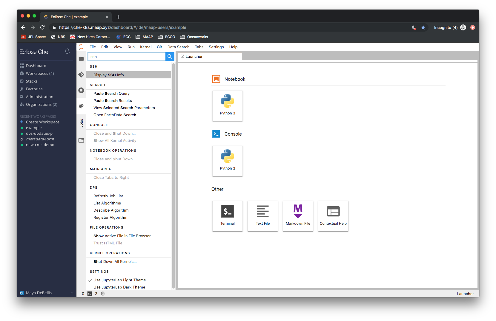
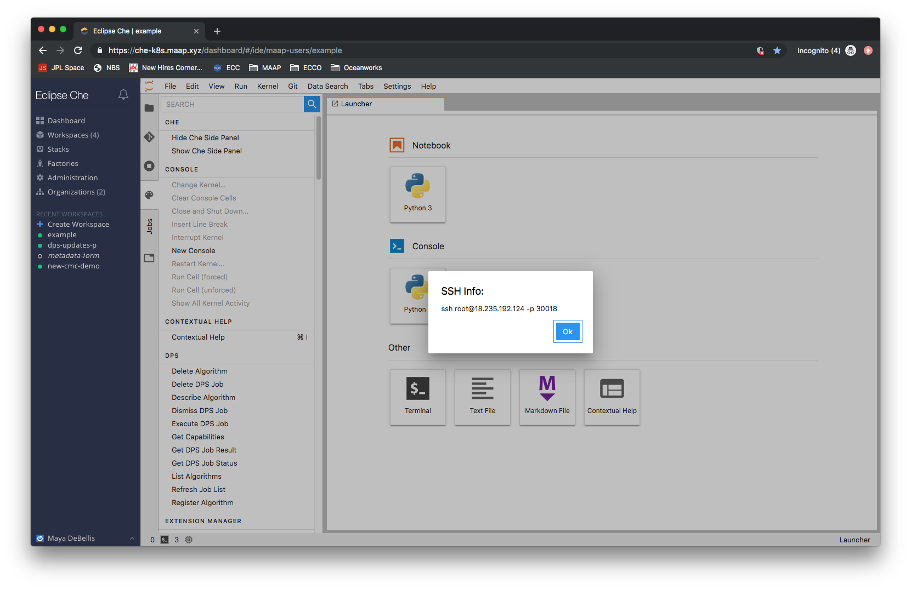

# SSH

As an alternative to using the jupyter interface, you can ssh directly into the container that your workspace set up.
In order to get the IP and port information, navigate to the command palette of the jupyter interface. Find the
command `Display SSH Info` (you can easily search for ssh) which will display the information you need. Your public
SSH key that you added to your account will be added to any workspace you create. If you did not upload an SSH key
to your profile, you will not be able to SSH in and must use the jupyter interface.

---
In the workspace administration section of che, you will see and SSH tab, nothing you do here will affect your workspace,
keys generated here are not valid.
##### For more info on things you should not do, see [here](./dont_touch.md)